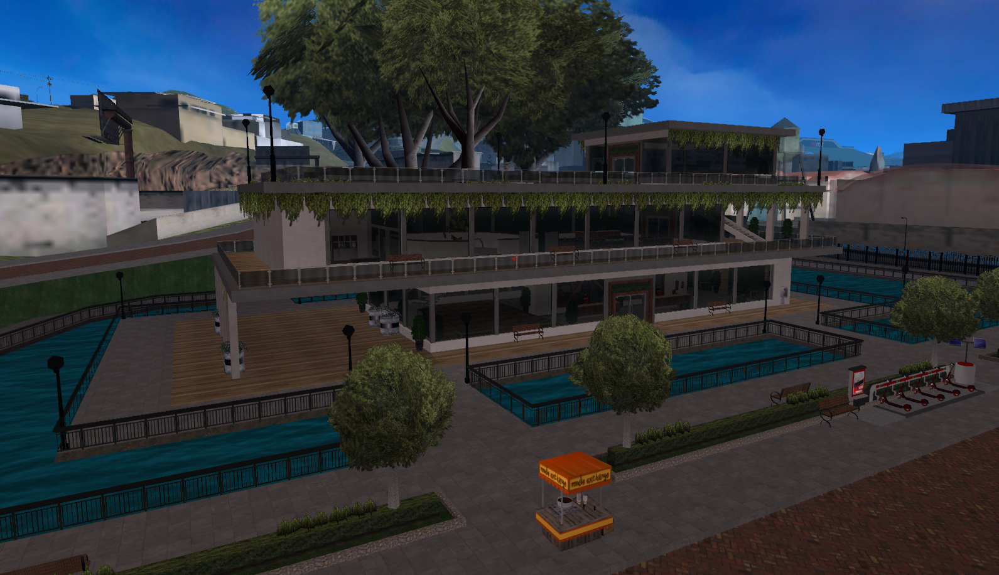
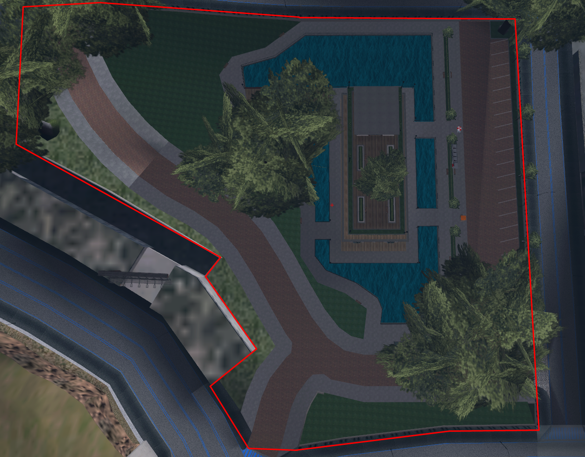

# Introdução

As Safe Zones são áreas protegidas da cidade onde os cidadãos podem realizar suas atividades com segurança, sem o risco de serem alvo de ações criminosas. Esses locais existem para garantir um ambiente organizado e equilibrado, permitindo que os jogadores realizem atendimentos, negociações, compras, trabalhos e demais interações de forma tranquila.

Será considerada como \*\*área segura\*\* toda a extensão do perímetro dos locais citados abaixo, abrangendo não apenas o interior dos estabelecimentos, mas também seus arredores:

Prefeitura

<figure><figcaption></figcaption></figure> <figure><figcaption></figcaption></figure>

Hospital


Qualquer tipo de roubo, assalto, furto, estelionato, extorsão ou prática semelhante está estritamente proibido dentro das [Áreas Civis.](https://app.gitbook.com/s/ZaeuUfASCM4NndN0jzW2/areas-civis) Nenhum jogador poderá utilizar a segurança proporcionada por esses locais para cometer tais atos.

